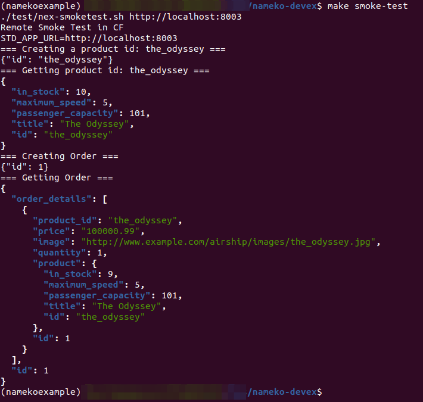
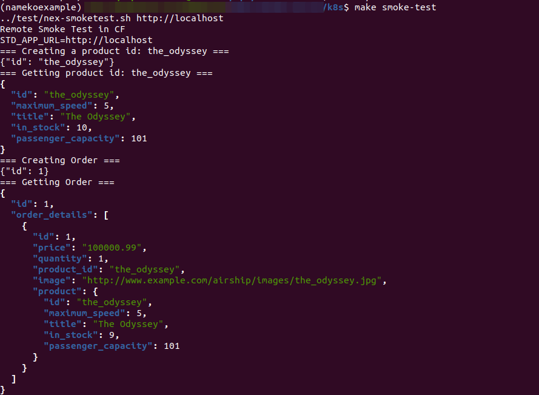
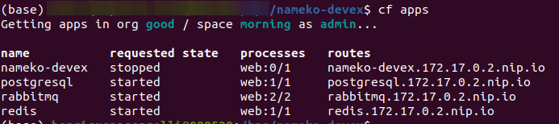

# Deploying nameko-devex by riqueps
## Prerequisites
The whole setup bellow was done using:
- Ubuntu Desktop 20.04 LTS (Focal).
- [Docker 20.10.17](https://docs.docker.com/engine/install/ubuntu/#install-using-the-repository)
- [Conda 4.12.0](https://docs.conda.io/en/latest/miniconda.html)
- [Docker Compose 2.6](https://github.com/docker/compose/releases)
- [Kind 0.14](https://github.com/kubernetes-sigs/kind/releases) for Deploy on K8S and Kind 0.7 for Deploy on CF due KubeCF compatibility
### Conda environment
```
conda env create -f environment_namekoexample.yml
```
### Create Docker images
To build the docker images, the Repo name of each application was edited to mine.
- [orders](orders/Makefile)
- [products](products/Makefile)
- [gateway](gateway/Makefile)

then I ran the command bellow for each image
```
make build-image
```
```
make push-image
```

## Deploy to Docker
---
Docker deployment is very binded on server infrastrucuture, so developers need to now exactly on which server them software will be deployed.

Developer need to build the docker images so they need know exactly which plataform they want to run them software.

There is no HA in this kind os environment.

The concept here is IaaS.

---
Deploy backing services (Postgres, RabbitMQ and Redis) running dev_run_backingsvcs.sh script.

Remeber to add your user to the Docker group to avoid running tests as sudo.
```
./dev_run_backingsvcs.sh
```
Deploy nameko application
```
make deploy-docker
```
In a new terminal I activated conda **namekoexample** environment and than I ran **smoke-test** and **perf-test**
```
conda activate namekoexample
```
### Smoke-test results



### Perf-test results 

[Summary Results](https://a.blazemeter.com/app/?public-token=kwmaZlQHIFXCNDBkUWSdq6i2ZPaUh2ppO3N5k4X77bcIXMSnpY#reports/r-ext-62a7ad013a1a1103870710/summary)

After the tests the app and backing services was undeployed
```
make undeploy-docker 
```
```
./dev_rm_backingsvcs.sh
```
## Deploy to KinD
---
On Kubernetes deployment, developers have a little more freedom to develop their software whitout care about the application availability, because Kubernetes will take care this for them., but they still need to build the images.

The concept here still IaaS.

---
Inside k8s folder I ran:
```
make deployK8
```
An error about Ingress object creation occurs, than I needed to each object separately:
```
make kind-setup-ingress
```
```
make init-helm
```
```
make create-namespace
```
```
make deploy-dependencies
```
```
make install-charts
```
In a new terminal I activate conda **namekoexample** environment and than I ran **smoke-test** and **perf-test**
```
conda activate namekoexample
```
### Smoke-test results



### Perf-test results 

[Summary Results](https://a.blazemeter.com/app/?public-token=RYddyv83WFUcntgsYhkEpd9LI9KOzDBgEq2oBmC4Q0CuqG3uVk#reports/r-ext-62a7ba7b2da01024765566/summary)

After the tests the app and backing services was undeployed
```
make undeployK8 
```

## Cloud Foundry
---
Cloud Foundry is a PaaS solution which let developers be freely to develop their software whiout care about the infrastructure the app will be deployed.

This would speed up software developement because developer doesn't need to pay attention on the infrastructure them software will running into, eg: build images, they just develop and push them code into CF and CF will take care of the rest.

The concept here is PaaS

---

### Deploy Kind cluster
```
kind create cluster --name kubecf
```
Create CFO namespace
```
kubectl create ns cfo
```
Deploy CF Operator from kubecf_bundle folder:

```
helm install cf-operator \
    --namespace cfo \
    --set "global.singleNamespace.name=kubecf" \
    ./cf-operator.tgz
```
After CFO was deployed successfully, install kubecf from kubecf_bundle:
```
helm install kubecf \
    --namespace kubecf \
    --values values.yaml \
    ./kubecf_release.tgz
```

After the deploy was copleted, I extracted the CF admin password
```
kubectl get secret \
        --namespace kubecf var-cf-admin-password \
        -o jsonpath='{.data.password}' \
        | base64 --decode 
```
Logged into cf
```
cf login --skip-ssl-validation -a https://api.172.17.0.2.nip.io -u admin
```
Create the org and space
```
cf create-org good
cf create-space -o good morning
```
### Backing Apps Deployment
I was trying to deploy backing services.

So I tried to deploy apps from docker images, but as soon after I was able to deploy it I realize that there is a diference between app and services in a CF environment.

**App:** consumed by a user

**Service:** Consumed by an app ou another service

So until today, june 13, I was not able to finish the tests in a Cloud Foundry environment.

#### Enable Docker
```
cf enable-feature-flag diego_docker
```
#### PostgresSQL
```
cf push postgresql --docker-image postgres:11.16-alpine
cf set-env postgresql POSTGRES_PASSWORD postgres
cf restage postgresql
```
#### Redis
```
cf push redis --docker-image redis:5.0.7
```
#### RabbitMQ
```
cf push rabbitmq --docker-image rabbitmq:3.8
```

